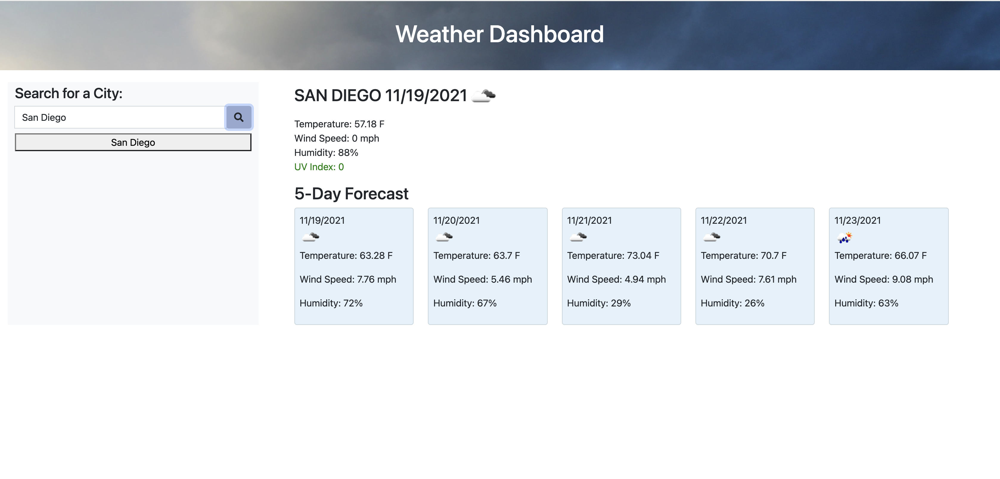

# WeatherDashboard

This is a simple web application that allows the user to search for a city, within the United State, and retrieve the current weather and a 5 day forecast. The current weather will provide the user with the temperature, humidity, wind speed and UV index (green:low, yellow:medium, red:high). Using local storage, your most 5 recent city searches will be saved for future viewing. 
 
## Acceptance Criteria
```
GIVEN a weather dashboard with form inputs

WHEN I search for a city
THEN I am presented with current and future conditions for that city and that city is added to the search history

WHEN I view current weather conditions for that city
THEN I am presented with the city name, the date, an icon representation of weather conditions, the temperature, the humidity, the wind speed, and the UV index

WHEN I view the UV index
THEN I am presented with a color that indicates whether the conditions are favorable, moderate, or severe

WHEN I view future weather conditions for that city
THEN I am presented with a 5-day forecast that displays the date, an icon representation of weather conditions, the temperature, the wind speed, and the humidity

WHEN I click on a city in the search history
THEN  I am again presented with current and future conditions for that city
```

## Link to Deployed Application

https://parisa-ostovari.github.io/WeatherDashboard/

## Link to GitHub Repository

https://github.com/parisa-ostovari/WeatherDashboard

## Screenshot
Here is the snapshot of how the website should look like:
 
 When first opened:
